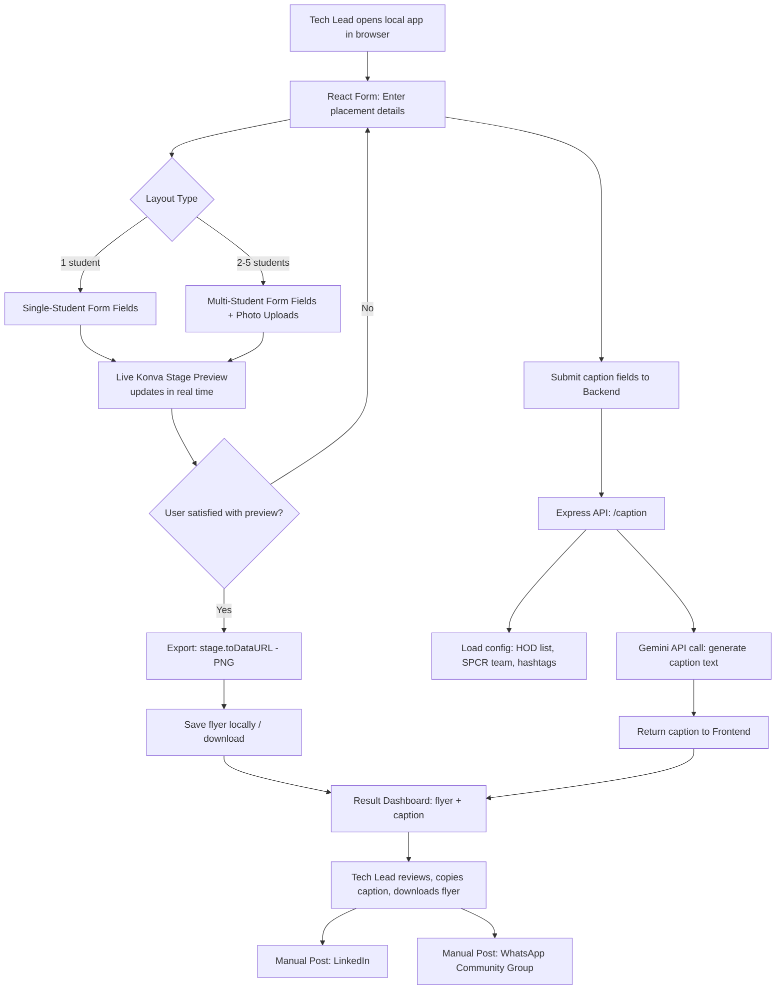
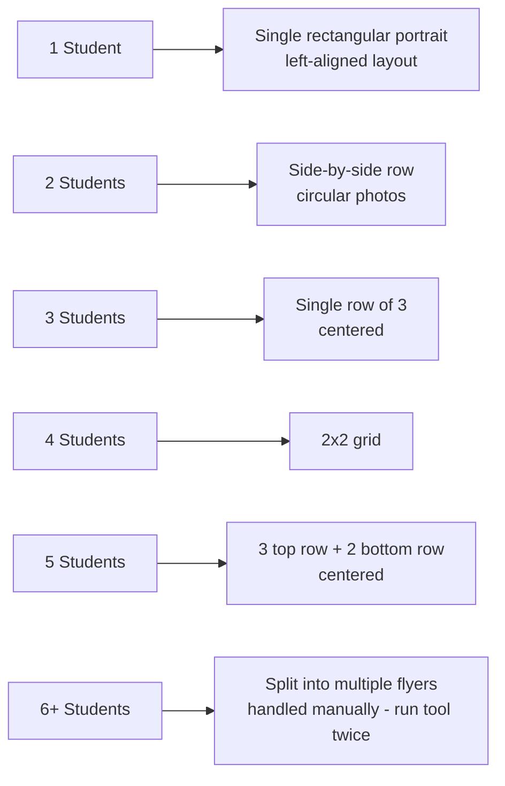
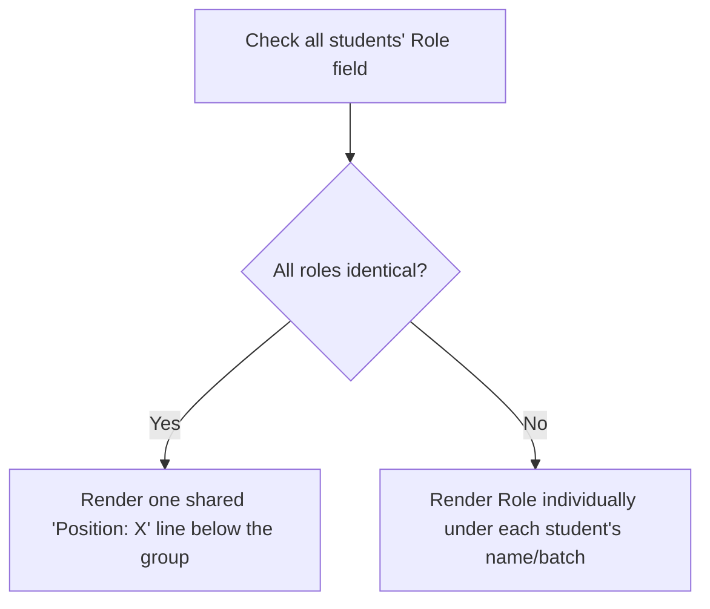
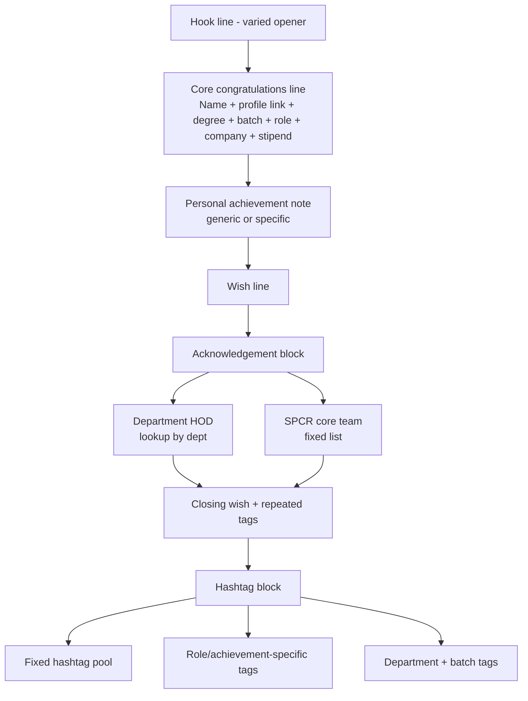
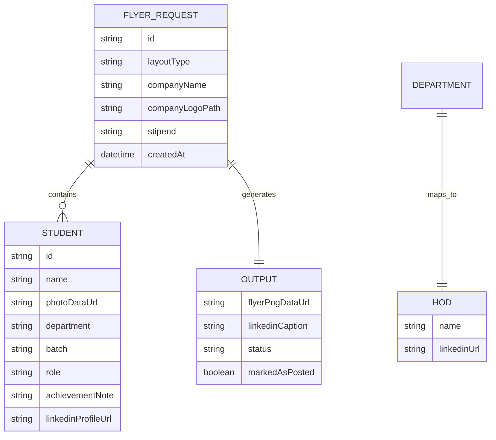
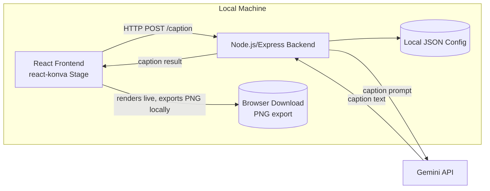
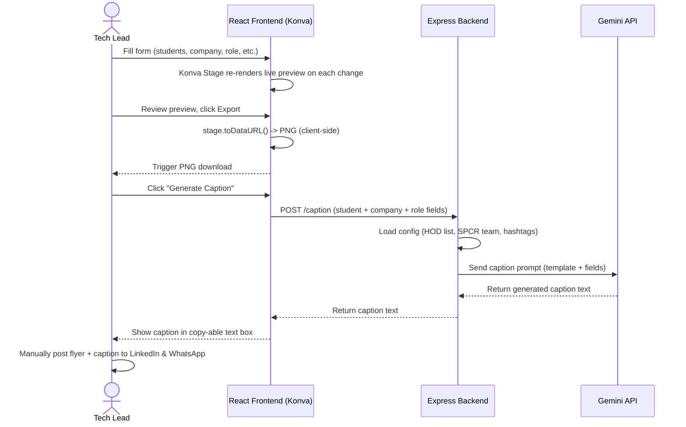

# Product Requirements Document (PRD)
## Placement Flyer & Announcement Automation Agent
### Ajeenkya DY Patil School of Engineering — Students Progression & Corporate Relations Office (ADYPG)

| Field | Value |
|---|---|
| Document Owner | Tech Lead, ADYPG |
| Status | Draft v2.0 |
| Last Updated | July 2026 |
| Target Users | Placement Cell / SPCR Office staff |
| Related Docs | v1.0 (superseded — used HTML/Playwright rendering) |

---

## 1. Background & Problem Statement

Every time a student or group of students secures a placement or internship, the placement cell manually:
1. Opens Canva, finds the right template, and manually fills in student photo(s), name(s), department, batch, company, and role.
2. Writes a LinkedIn announcement by hand — copying the same credit/tag block (HOD, SPCR team, hashtags) every time and editing only the student-specific details.
3. Writes a shorter announcement for the internal WhatsApp community group.
4. Manually posts the flyer + captions to LinkedIn and WhatsApp.

This is repetitive, error-prone (inconsistent formatting across posts, as seen in past flyer variants — different fonts, footers, and header treatments were found across historical examples), and time-consuming at scale — especially during peak placement season when many students are placed in a short window.

### 1.1 Evidence Gathered

Analysis of past flyers surfaced **at least three visually distinct design languages** in use historically (different footer bars, icon sets, and typography), confirming the need for one standardized, code-enforced template rather than continued freeform Canva editing. Analysis of past LinkedIn captions confirmed a **highly repeatable structural pattern**: a hook line, a core congratulations line, an acknowledgement/credits block naming the same recurring people, and a hashtag set — with only a handful of fields actually varying post to post.

## 2. Goals

- **Standardize** the flyer design into one consistent theme/header/footer across all student-count variants (1–5 students).
- **Automate** flyer image generation from structured input data (name, photo, company, role, batch, dept) with a **live, in-browser preview** before export.
- **Automate** LinkedIn caption generation using a fixed credit/hashtag template with AI-generated variable content (hook line, achievement note).
- **Keep posting manual** — LinkedIn and WhatsApp posting stay human-controlled (no direct API auto-posting), since:
  - WhatsApp has no reliable/official API for posting into groups.
  - LinkedIn personal profile posting via API is heavily restricted, and impersonation risk / account suspension risk from unofficial automation is not worth taking for a low-volume, low-frequency task.
- **Reduce time-to-post** from manual design work (~20-30 minutes per flyer) to a few minutes of data entry + review.
- **Keep student photos and personal data local** — no third-party cloud services required to generate the artifact itself.

## 3. Non-Goals (v1)

- No automatic posting to LinkedIn or WhatsApp (manual copy/paste/upload by the placement cell).
- No multi-user auth/roles — single local user (tech lead) for v1.
- No cloud hosting — runs on a single local machine.
- No support for more than 5 students per flyer (split into multiple flyers beyond that, handled manually by running the tool twice).
- No automated WhatsApp caption generation in v1 (tone/template to be supplied separately and added in a fast-follow).
- No image-hosting/CDN service (e.g. Cloudinary) in v1 — considered and deferred; see Section 14 (Alternatives Considered).

---

## 4. Users

| User | Description |
|---|---|
| Tech Lead (Primary) | Runs the tool locally, enters placement data, reviews/downloads output, posts manually |
| SPCR Office Staff (Secondary, future) | May eventually use the same local tool if extended beyond one machine |

### 4.1 User Story Summary

- *As the tech lead*, I want to enter a student's placement details once and get a polished, on-brand flyer without opening Canva, so that I save design time.
- *As the tech lead*, I want to see the flyer update live as I type, so I can catch mistakes (wrong photo, typo in company name) before exporting.
- *As the tech lead*, I want a ready-to-post LinkedIn caption with the correct HOD and team tags automatically pulled in, so I don't have to remember or copy-paste the credit block every time.
- *As the tech lead*, I want student photos to never leave my machine during generation, so that I don't introduce a privacy/compliance concern.
- *As the tech lead*, I want to handle group placements (2–5 students) with the same tool, so I don't need a separate manual process for those cases.

---

## 5. System Overview

A single-machine, locally-run web application. The **frontend (React) now owns the entire flyer-rendering pipeline** using **Konva / react-konva**, rendering the flyer as a live canvas scene that updates as the user fills the form, then exporting directly to PNG client-side. The **backend (Node.js/Express)** is thinned down to handle only the **Gemini API call for caption generation** and serving/storing static config.

---

## 6. Functional Requirements

### 6.1 Data Entry Form (Frontend)

| Field | Applies To | Notes |
|---|---|---|
| Layout type | All | 1 / 2 / 3 / 4 / 5 students; drives which Konva layout template loads |
| Student name | Per student | |
| Student photo | Per student | Uploaded via file input, loaded into Konva as an `Image` node, clipped to circular/oval frame client-side |
| Department | Per student | Drives HOD lookup for caption generation |
| Batch year | Per student | e.g. 2027 |
| Role / designation | Per student | Can differ within a group |
| Company name | Shared (per flyer) | May be "Product-based company" if anonymized |
| Company logo | Shared (per flyer) | Optional upload, rendered as a Konva `Image` node |
| Stipend / package | Shared or per student | |
| Achievement note | Per student, optional | e.g. "Hackathon Winner" — feeds into caption generation only, not necessarily shown on the flyer itself |
| Student LinkedIn profile URL | Per student | Required for caption generation (used for the `[Name](profile link)` mention) |

**Validation rules**:
- Layout type must match the number of student entries provided (block submission otherwise, with an inline warning).
- Photo upload required per student before export is enabled (placeholder silhouette shown until then, so the live preview never looks broken).
- Department must match a known key in `hod-list.json`; if not found, show a warning but allow manual HOD override for that one flyer.

### 6.2 Flyer Rendering Engine (Konva)

- Rendering happens **entirely client-side** in the browser via `react-konva`.
- One **master design system** (fixed header, background, footer) reused across all layouts — implemented as reusable Konva components (`<FlyerHeader />`, `<FlyerFooter />`, `<StudentCard />`, `<PhotoGrid />`).
- **Header (fixed)**: tagline quote, accreditation line, badge row (AICTE/NAAC/NIRF/ISO/NBA) rendered as static `Image` assets, crest, university name block rendered as styled `Text` nodes.
- **Body**: "Congratulations" script heading (custom font, pre-loaded via `document.fonts.load()` before the Konva stage renders); photo grid that adapts to student count (see 6.2.1); name/dept/batch/role per student; shared company name + logo.
- **Footer (fixed)**: SPCR office credit line, website, social icons — static `Image`/`Text` layer, identical across every export.
- **Live preview**: the Konva `Stage` re-renders on every form field change (React state → props → Konva nodes), so the user always sees the current draft before exporting.
- **Export**: `stage.toDataURL({ pixelRatio: 2 })` (or higher, e.g. 3, for crisper LinkedIn/WhatsApp upload quality) triggers a client-side PNG download — no server round-trip, no backend rendering dependency.
- **Asset loading**: all fixed assets (crest, badges, background texture, building watermark, social icons) are bundled locally in the frontend's `public/assets` folder — no runtime network fetch required for rendering.

#### 6.2.1 Photo Grid Layout Logic

Each layout is implemented as a distinct Konva layout component consuming the same `StudentCard` sub-component, so visual consistency (font, color, spacing rhythm) is guaranteed by construction rather than by manual pixel-matching each time.

#### 6.2.2 Role Field Collapsing Logic

Since roles can differ within a group (confirmed via earlier discussion — same company, different roles is a real case), the renderer applies this rule:

### 6.3 Caption Generation (LinkedIn) — Backend Responsibility

Fixed structure, AI fills variable segments. This remains a **backend** concern (Gemini API key must never be exposed client-side):

For group flyers: core line loops through multiple names ("Heartiest congratulations to X, Y, and Z"), each individually linked; shared company/role fields are consolidated, differing roles listed per student, mirroring the same collapsing logic used in the flyer itself (Section 6.2.2) so the caption and flyer never contradict each other on this point.

### 6.4 Config Data (Static, Editable JSON)

| Config File | Contents | Owner |
|---|---|---|
| `hod-list.json` | Department → HOD name + LinkedIn profile URL | Backend (read at caption-generation time) |
| `spcr-team.json` | Fixed team member names + profile URLs + ADYPU SPCR company page link | Backend |
| `hashtags.json` | Fixed hashtag pool + rules for achievement-specific tag selection | Backend |
| `flyer-assets.json` (new) | Manifest of static asset paths (crest, badges, background, watermark, fonts) consumed by the Konva frontend | Frontend |

Config files are editable directly (plain JSON, no admin UI in v1) — a deliberate simplicity trade-off given the single-user, low-change-frequency nature of this data.

### 6.5 Result Dashboard

- Live Konva flyer preview (pre-export) + "Export PNG" button (post-export, triggers download)
- Caption text box with copy-to-clipboard button
- Explicit "Mark as Posted" checkbox/log (local only, for the tech lead's own tracking — not synced anywhere)
- No auto-posting; manual action required by design

### 6.6 Error Handling Requirements

| Scenario | Expected Behavior |
|---|---|
| Missing student photo | Block export, show inline placeholder + warning message |
| Gemini API failure / timeout | Show error in caption panel; flyer preview/export still fully functional independently (caption and flyer generation are decoupled) |
| Unknown department (no HOD match) | Warn but allow manual override entry for that session |
| Layout/student-count mismatch | Block submission, inline validation message |
| Custom font fails to load | Fallback to closest bundled web-safe font, log a console warning (should not silently break layout) |

---

## 7. Data Model

Note: since rendering is now client-side, `photoDataUrl` and `flyerPngDataUrl` live in browser memory/state during a session rather than being persisted server-side by default. If historical record-keeping across sessions is desired, a lightweight local "save to outputs/ folder" step can be added (see Section 12, Milestone M4a).

---

## 8. Technical Architecture & Stack

| Layer | Technology | Rationale |
|---|---|---|
| Frontend | React + react-konva (Konva) | Live, WYSIWYG canvas rendering in-browser; no headless browser dependency; precise control over circular crops, grids, and text via Konva nodes |
| Backend | Node.js + Express | Thin service — only handles the Gemini API call for caption generation and config serving |
| Flyer Rendering | Konva `Stage`/`Layer`/`Image`/`Text`/`Group` nodes, exported via `stage.toDataURL()` | Client-side, instant, no server round-trip; matches the "simple, one machine, no hosting" requirement precisely |
| Caption Generation | Gemini API (server-side call only) | LLM call using fixed template + variable fields; API key stays server-side, never exposed to the browser |
| Storage | Local JSON config files + browser-triggered file download (no DB) | No DB needed at this scale/volume; optional local `outputs/` folder save as a nice-to-have |
| Deployment | Single local machine, no hosting | Simplicity for v1; revisit hosted/multi-user version later if needed |

### 8.1 Why Konva Over the Originally Proposed HTML/Playwright Approach

| Concern | HTML + Playwright (v1.0 plan) | Konva (v2.0, current) |
|---|---|---|
| Rendering location | Server-side (headless Chromium) | Client-side (browser canvas) |
| Preview before export | None — submit, wait, then see result | Live, real-time as you type |
| Dependency footprint | Playwright + Chromium binary (~300MB) | None — just a JS library |
| Photo privacy | Photos sent to backend for rendering | Photos never leave the browser tab during rendering |
| Maintainability of layouts | CSS grid/flexbox per layout | Reusable Konva components per layout |
| Backend complexity | Full rendering pipeline | Thin — caption generation only |

---

## 9. Request Lifecycle (Sequence)

---

## 10. Non-Functional Requirements

- **Performance**: Live Konva preview should re-render within a frame or two of any form change (sub-100ms feel); PNG export should complete in under 2 seconds; caption generation (network + LLM round trip) should complete within ~5-10 seconds.
- **Reliability**: Local-only, no uptime SLA needed; failures should show clear, specific error messages (e.g. missing photo, Gemini API failure) rather than silent failures.
- **Maintainability**: Template/layout changes should only require editing Konva component code (positions, sizes, styles) — no coordinate recalculation across unrelated files.
- **Portability**: Should run with just Node.js installed; no browser automation binaries required (a meaningful simplification versus the original plan).
- **Data Privacy**: Student photos and personal data stay entirely within the local browser session during flyer rendering — **no photo data is ever sent to any external API**. Only text fields (name, role, company, department, batch, achievement note, and a LinkedIn profile URL) are sent to the Gemini API, and only for the purpose of generating caption text.
- **Offline resilience**: Flyer rendering/preview/export works fully offline (no network dependency); only the caption-generation step requires internet connectivity.
- **Accessibility (minor)**: Form should support standard keyboard navigation and clear labels, given single-user context this is a "nice to have" rather than a hard requirement in v1.

---

## 11. Security Considerations

- Gemini API key stored server-side only, in a `.env` file excluded from version control (`.gitignore`).
- No authentication layer in v1 given single local user — **not to be exposed on a public network/port** without adding auth first.
- Config files (`hod-list.json`, `spcr-team.json`) contain real names and LinkedIn URLs of staff — should be treated as internal data, not committed to a public repository if this project is ever pushed to GitHub; recommend a private repo or excluding config from version control and documenting the expected file shape instead.
- Uploaded student photos exist only in browser memory/local state during a session — no persistence to disk is required for the render pipeline to function, minimizing accidental data retention.

---

## 12. Open Items / Inputs Needed Before Build

- [ ] Final Department → HOD list (names + LinkedIn URLs)
- [ ] SPCR core team list confirmation (names + LinkedIn URLs)
- [ ] Fixed hashtag pool finalization
- [ ] Font names/assets used in the Canva template (or approved close matches) — needed as font files for Konva's `document.fonts.load()` step
- [ ] College logo + accreditation badge assets (transparent PNGs), to be bundled in `public/assets`
- [ ] WhatsApp caption tone/template (separate from LinkedIn) — deferred to fast-follow
- [ ] Gemini API key for caption generation

---

## 13. Milestones (Proposed)

| Milestone | Deliverable |
|---|---|
| M1 | Project scaffold (React + Express); static config files; Konva stage set up with fixed header/footer components and background assets |
| M2 | Single-student layout fully working in Konva (photo clip, text fields, live preview, PNG export) |
| M3 | Multi-student layouts (2–5) with dynamic photo grid and role-collapsing logic |
| M4 | Caption generation integrated (Gemini API + fixed template) via thin backend |
| M4a (optional) | Local "save flyer + caption to `/outputs` folder" convenience feature, if session history tracking is desired |
| M5 | Result dashboard polish (preview, download button, copy caption, mark-as-posted checkbox) |
| M6 | End-to-end test with real sample data (Atharva Sakpal single-student case; Evonence/GlobalStep/KAMTOWER group cases) |
| M7 | Error handling pass + documentation (README with setup steps, `.env` instructions, config file guide) |

---

## 14. Alternatives Considered

| Option | Verdict | Reason |
|---|---|---|
| Canva API / Autofill | Rejected | Requires Teams/Enterprise plan not currently available |
| Python + Pillow (PIL) manual coordinate drawing | Rejected | High maintenance cost — every layout tweak requires recalculating pixel coordinates; harder to match gradients/rounded-corner clipping cleanly |
| HTML/CSS + Playwright (headless Chromium) | Superseded | Works, but adds a heavy binary dependency, server-side rendering step, and no live preview; Konva achieves the same visual fidelity with less overhead |
| n8n (self-hosted or cloud) | Rejected | User preference against a low-code orchestration layer for this use case |
| Cloudinary (URL-based overlay transformations) | Deferred | Feasible for fixed single-layout cases, but awkward for variable 1–5 student layouts (long chained transformation URLs), requires uploading student photos to a third-party cloud service (conflicts with local-data-privacy goal), and loses the live in-browser preview Konva provides. May be revisited if this project evolves into a hosted, multi-user tool where CDN delivery becomes valuable |
| Konva (client-side canvas rendering) | **Selected** | Live preview, no external dependencies beyond a JS library, photos never leave the browser, clean component-based layout logic |

---

## 15. Appendix: Reference Flyer Examples Analyzed

- Single-student flyer (rectangular photo, red script "Congratulations") — establishes header/footer/theme baseline
- 2-student flyer (circular photos, shared "Placed at" + "Position" line) — confirms accreditation-badge header is the standardized version going forward
- 3-student flyer (rounded-square photos, ribbon icon accents) — noted as an inconsistent past variant, not carried forward into the standardized template
- 8-student flyer (2-row grid, stipend + company banner footer) — noted as an inconsistent past variant (different footer/typography), not carried forward
- 5-student flyer (3+2 grid style, per-student "from ADYPSOE" line) — used to derive the 5-student grid layout logic
- Sample LinkedIn captions (Atharva Sakpal, Raunak Jha) — used to derive the fixed credit block and hashtag pattern
